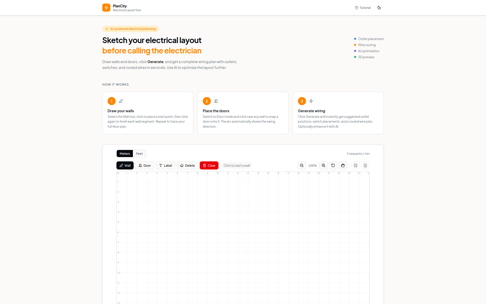
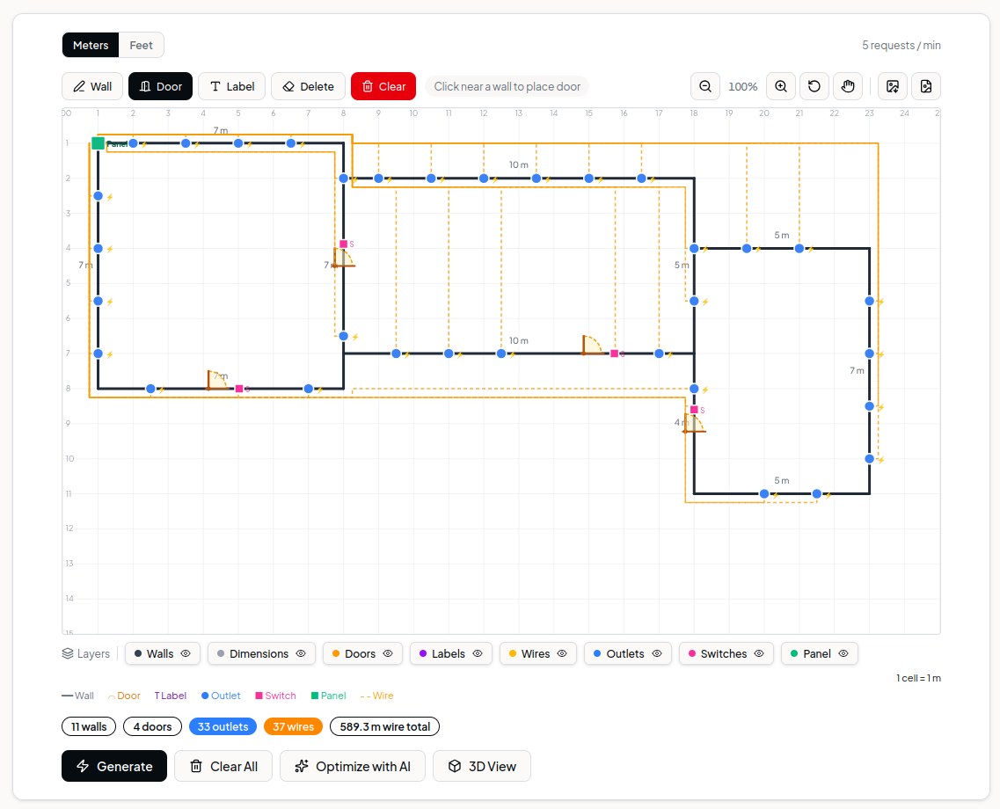
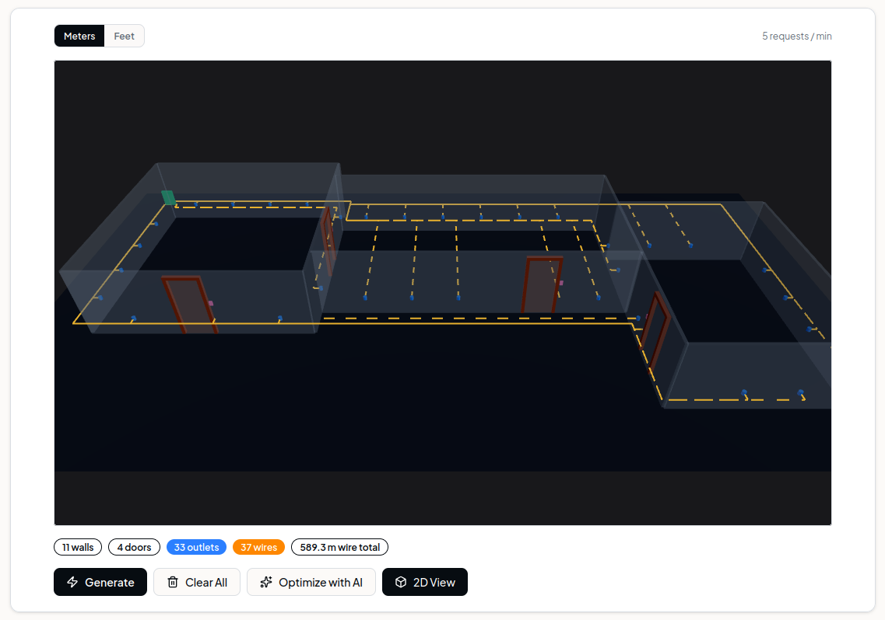

# PlanCity

**Quick Wiring Sketch Tool**

A lightweight tool for sketching a rough electrical wiring plan before working with a licensed electrician. Draw walls and doors, hit Generate, and get a suggested outlet placement and wire route in seconds.

> **Not a replacement for professional tools or a licensed electrician.** PlanCity is meant for quick ideation and communication — not code-compliant electrical design.



## Features

- **2D Canvas Drawing** — Draw walls, doors, labels, and rooms on an interactive grid
- **Auto Layout Generation** — Click "Generate" to auto-place outlets, switches, and route wires
- **AI Optimization** — Use "Optimize with AI" to improve the layout using OpenAI
- **3D Viewer** — Visualize your floor plan in a 3D perspective with wire routing





## Stack

- **Frontend**: React 19 + Vite + TypeScript
- **Backend**: Node.js + Express + TypeScript
- **Validation**: Zod
- **AI**: OpenAI API
- **Package manager**: pnpm (workspaces)
- **Linting / Formatting**: Biome

## Project Structure

```
plancity/
├── apps/
│   ├── frontend/   # React app (port 3000)
│   └── backend/    # Express API (port 3001)
├── images/         # Screenshots and assets
├── docs/           # Planning and architecture docs
├── biome.json
├── tsconfig.base.json
└── pnpm-workspace.yaml
```

## Setup

```bash
pnpm install
```

## Development

```bash
pnpm dev        # starts frontend + backend in parallel
```

## Environment Variables

Create a `.env` file at the root (or in `apps/backend/`) with:

```env
OPENAI_API_KEY=your_key_here
CORS_ORIGIN=http://localhost:3000
```

## Scripts

| Script        | Description                      |
| ------------- | -------------------------------- |
| `pnpm dev`    | Start all apps in watch mode     |
| `pnpm build`  | Build all apps                   |
| `pnpm check`  | Biome lint + format (with fixes) |
| `pnpm lint`   | Biome lint only                  |
| `pnpm format` | Biome format only                |

## Docker / Deployment

The project includes Docker support via `docker-compose.yml`, configured for deployment with [Dokploy](https://dokploy.com).

```bash
docker compose up --build
```

Required environment variables for production:

| Variable        | Description                        |
| --------------- | ---------------------------------- |
| `OPENAI_API_KEY`| OpenAI API key for AI optimization |
| `CORS_ORIGIN`   | Allowed frontend origin            |
| `PORT`          | Backend port (default: `3000`)     |
